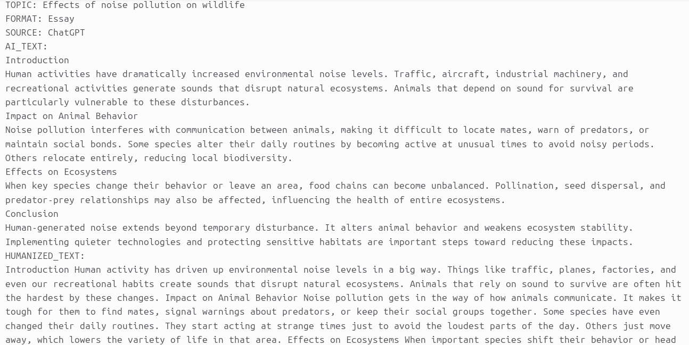

 # AI vs Humanized Academic Writing Dataset

A dataset containing **AI-generated and humanized academic writing samples** created for research in Natural Language Processing (NLP), Large Language Models (LLMs), AI text analysis, and text transformation.

## Overview

This dataset was created as part of our work on building AI systems for academic writing. It contains paired examples of **AI-generated academic content** and their corresponding **humanized versions**.

The goal is to support researchers, developers, and the AI community in studying how AI-generated academic writing differs from more natural human-like writing.

## Dataset Statistics

- **Total Samples:** 2,000 AI-generated and humanized text pairs
- **Academic Topics:** 250 unique topics
- **Variations per Topic:** 8–10 different variations
- **Writing Categories:**
  - Essays
  - Reports
  - Assignments
  - Opinion Pieces
  - Structured Reports
  - Case Studies
  - Literature Reviews
  - And more

## Data Collection

The AI-generated academic content was created using multiple large language models, including:

- ChatGPT
- Claude
- DeepSeek
- Gemini
- Grok
- Groq-based LLM models

The generated responses were then humanized to create a parallel dataset containing more natural, readable, and human-like versions while preserving the original meaning.

## Dataset Structure

Each sample contains:

| Column | Description |
|--------|-------------|
| `topic` | Academic topic or subject |
| `format` | Writing format/category |
| `source` | AI model used for generation |
| `ai_text` | Original AI-generated academic writing |
| `humanized_text` | Humanized version of the AI-generated text |

## Example

### AI Generated Text

Noise pollution has become an increasing environmental concern due to expanding urbanization...

### Humanized Text

In recent years, noise pollution has emerged as a serious environmental issue as cities continue to grow...

## Applications

This dataset can be used for:

- AI-generated text detection
- AI text classification
- Humanization and rewriting models
- Style transfer research
- LLM evaluation
- NLP benchmarking
- Academic writing assistants
- AI writing analysis

## Related Dataset

A separate collection of **2,000 raw AI-generated academic writing samples before humanization** is also available:

Dataset link:
https://www.kaggle.com/datasets/allamdarali/ai-academic-dataset

## Usage

Researchers and developers can use this dataset for educational and research purposes.

If you use this dataset in your work, please consider citing this repository.

## License

Please check the repository license before using this dataset for commercial or research purposes.

## Acknowledgements

Thanks to the open-source AI and research community for advancing NLP, LLMs, and responsible AI development.

## Contact

For questions, feedback, or collaboration opportunities, feel free to open an issu
